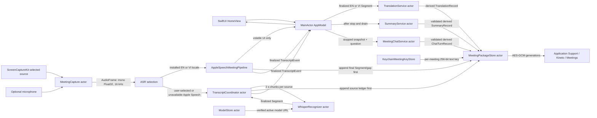

# System Architecture

## Overview

Kineto is a native, sandboxed Apple Silicon application for macOS 26.1+. The implemented vertical slice captures a user-selected app or display plus an optional microphone, transcribes locally with a user-selected runtime-supported Apple SpeechAnalyzer locale for live partial captions and final segments, falls back to pinned `whisper.cpp` for automatic multilingual recognition or when Apple Speech is unavailable, translates finalized English/Vietnamese segments with Apple Translation, creates a post-stop conversation summary with Foundation Models, and stores meeting text in authenticated encrypted packages.

The main application has no network client entitlement. Model acquisition is outside the meeting path: the user imports a file, or a development checkout supplies one. Runtime meeting processing is local. Raw audio retention is off in `AppModel.startMeeting()` (`retainsAudio: false`), and no audio writer is connected in this slice.

## System Boundaries

| Boundary | Inside | Outside / explicit dependency |
|---|---|---|
| App process | `KinetoApp`, `KinetoCore`, optional bundled `CWhisper.xcframework` fallback | Selected source app/display and optional microphone |
| Apple platform | SwiftUI/AppKit, ScreenCaptureKit, AVFoundation, Speech, Translation, Foundation Models, CryptoKit, Security/Keychain | OS permissions, installed Speech/Translation assets, Foundation Models availability |
| Local data | `Application Support/Kineto/Meetings` and `Application Support/Kineto/Models` | User-selected plaintext export destination |
| Network | No main-app network entitlement in `KinetoApp/Kineto.entitlements` | The pinned descriptor records an origin URL, but the app does not download it |
| Trust | Finalized `Segment` and `TranscriptGap` records are source ledger entries | `TranslationRecord` and `SummaryRecord` are derived records and must not replace source text |

## End-to-End Data Flow



1. `HomeView` drives `AppModel` through home, preflight, live, processing, summary, and privacy screens. The system `SCContentSharingPicker` supplies a `CaptureTarget`; Kineto excludes its own bundle from picker choices. Consent plus either an installed Apple Speech locale or a warmed verified Whisper fallback are required before start.
2. `AppModel` probes every Apple Speech locale exposed by the running macOS, exposes each one with its install state, and defaults to Apple Speech when the selected locale is installed. The automatic option and unavailable assets route to Whisper. It warms the 574 MB Whisper/Metal context when a verified model is present, so fallback does not pay cold initialization latency at start.
3. `MeetingCapture` configures `SCStream` for audio only and excludes Kineto's own process audio. An optional `AVAudioEngine` tap captures the microphone as a separate `AudioSource`.
4. Separate `AudioNormalizer` actors convert owned callback-buffer copies to non-interleaved mono Float32 at 16 kHz and emit timestamped `AudioFrame` values. Four-slot admission per source bounds work awaiting normalization; overflow, conversion failure, source loss, output saturation, and timestamp discontinuity become duration-bearing gaps rather than fabricated transcript text.
5. The Apple path reserves the selected locale through the app-owned `AppleSpeechCapability`, creates one `SpeechAnalyzer` / `SpeechTranscriber` session per capture source, and emits volatile live text only to SwiftUI. It persists each final `Segment` before publication and ignores punctuation-only recognizer output. A result-stream error or exhaustion cancels only its source session, coalesces the cooldown/startup interval into one durable `TranscriptGap`, and retries a fresh session after one second; capture end persists any unresolved recovery gap.
   While capture is active, `AppModel` coalesces floating-caption delivery to at most 4 Hz. `FloatingCaptionOverlayPresentation` carries the canonical `SignalGatePresentation` snapshot but projects it only when active capture is in the explicit `CapturePresentationMode.floating` state. A linked pair of automatic `NSPanel`s remains nonactivating: a compact transcript subtitle bar follows below a tight transparent decorative companion AppKit child panel. The caption anchor is the sole persisted placement, and companion placement is derived from it. On successful Start Meeting, `AppModel` enters floating mode and `KinetoApp` reversibly orders every identified main `WindowGroup` window out with `orderOut(nil)`; it does not close those windows. The subtitle bar conditionally renders compact Pause, Stop & Process, and Show Meeting Details controls from the canonical snapshot; each emits `SignalGateAction` only to `AppModel.performSignalGateAction(_:)`, which revalidates availability. Show Meeting Details sets the mode back to `.mainWindow`, hides the pair, and reveals the existing live meeting window rather than creating a route or second panel. Pause, Stop & Process, source loss, processing, and every non-capturing phase likewise return to `.mainWindow` and hide the pair. Resume leaves the main window shown; the live meeting's explicit Use Floating Captions action is the only re-entry path. Controls are separate from the header drag region and caption text remains noninteractive. `FloatingCaptionPanelCoordinator` owns a transient `FloatingCaptionDragSession`: during an active companion pointer drag it retains the linked caption anchor, caption panel/frame, and companion geometry but visually suppresses the caption surface, makes its controls inaccessible, defers live delivery, and keeps only the latest pending presentation. On companion-drag end it persists the one caption anchor and immediately restores that latest presentation.
   Pet Mode is an optional, default-off original pixel-art companion with five immutable catalog themes—Signal Cat, Orbit Fox, Beacon Frog, Night Owl, and Meadow Rabbit. It is configured in global Kineto Settings, shown only during active capture, and receives non-content `FloatingCaptionPetState` plus persisted appearance, size, motion, and opaque canonical sRGB accent preferences. Settings are encoded as a versioned Codable snapshot; missing or invalid fields fall back independently, and failed color-picker conversion retains the prior valid accent. It cannot inspect, reveal, retain, log, or react to caption/transcript text, translations, audio, speaker identity, source application/window identity, or sentiment; it has no independent placement persistence, capture data, transcript data, or work; it accepts no focus and remains subject to normal screenshot and screen-share compositing. Its arbitrary accent applies only to companion pixels, never to recording, warning, transcript, translation, focus, or action semantics. Its sole motion is one non-looping 200 ms transform/opacity state transition; it is static with Reduce Motion.
6. The Whisper fallback path uses `TranscriptCoordinator` to group each source into two-second chunks, permits one in-flight plus two queued jobs per source, and persists explicit gaps for saturated chunks or discontinuous timestamps. It sorts returned segments by start time, persists each segment, then publishes `.finalized`. Capture end flushes residual samples and awaits recognition before transcript closure.
7. `WhisperRecognizer` rejects chunks without at least 100 ms of sustained signal, decodes each admitted chunk without cross-chunk context, and discards segments classified as no-speech. It calls the pinned local C runtime with Metal enabled, at most four CPU threads, timestamps enabled, and translation disabled. Every emitted `Segment` has `isFinal == true`; Whisper supplies its detected BCP-47 language tag.
8. SwiftUI `translationTask` sessions prepare both EN↔VI assets from explicit preflight intent and remain scoped to their task closures; translation-enabled start stays gated until both directions are ready. `TranslationService` creates and serially uses its own installed-language sessions. `AppModel` consumes source events immediately and tracks translation separately. After source sealing, missing translations are reconciled before summary generation; storage accepts idempotent derived translation writes after stop.
9. Stop waits for capture and source-transcript drain, seals the source ledger as `.stopped`, completes remaining translations, and only then invokes `SummaryService`. The user chooses an Executive brief, Action plan, or Discussion notes contract; Foundation Models runs fresh-session map passes over chronological blocks and the selected sections are ordered and capped before persistence. If the model is unavailable or yields no valid items, an extractive fallback preserves the same template and cites exact source quotes. Invalid generated fields are omitted independently.
10. `MeetingPackageStore` persists source and derived records together in an authenticated snapshot. The UI reloads encrypted snapshots into its observable state, supports evidence navigation, plaintext transcript export, and deletion.
11. In Summary/reopened-meeting review, `AppModel` gives `MeetingChatService` one authenticated stopped snapshot and a question. The actor lexically retrieves only final source segments plus gap boundaries, creates a fresh tool-free Foundation Models session, validates literal contiguous source citations, and returns a grounded or truthful no-answer turn. The store appends completed turns as encrypted derived records; no provider, network, prior chat history, translation, or summary enters the model context.

## Source Ledger vs. Derived Records

This distinction is structural and enforced at persistence boundaries:

- **Finalized source:** `Segment` is the recognized transcript record. `MeetingPackageStore.append(_ segment:)` rejects `isFinal == false`; IDs must be unique. `TranscriptGap` is also authoritative evidence that an interval was unavailable or dropped.
- **Derived translation:** `TranslationRecord` references exactly one existing `sourceSegmentID`. It is stored separately, never edits `Segment.text`, and may complete after the source ledger is sealed.
- **Derived summary:** `SummaryRecord` is allowed only after the meeting is stopped. It records the selected template ID/version, and each `SummaryItem` carries abstractive prose plus `EvidenceReference` values with exact source quotes.
- **Derived chat:** `ChatTurnRecord` is allowed only after stop. It stores the question, grounded or no-answer outcome, answer text, response language, and exact `EvidenceReference` values; it never changes source records. No-relevant-evidence turns have no citations, while other no-answer turns retain only retrieved source excerpts.
- **UI rule:** `segments`, `gaps`, `translations`, `summary`, and `chatTurns` remain separate collections in `AppModel`. Translation, summary, or chat failure leaves the finalized source ledger intact.

## Responsibilities by Component

| Component | Responsibility | Does not own |
|---|---|---|
| `MeetingCapture` | ScreenCaptureKit/AVFoundation lifecycle; source-separated capture; pause/resume/stop; capture gaps | ASR, persistence, UI state |
| `AudioNormalizer` | Format conversion to the ASR contract | Queueing or inference |
| `TranscriptCoordinator` | Whisper-only per-source chunking, flush/drain, finalized segment and gap persistence, transcript events | Apple Speech lifecycle, model verification, translation |
| `AppleSpeechCapability` / `AppleSpeechMeetingPipeline` | Installed-locale probe and reservation, per-source SpeechAnalyzer streaming, recovery-gap persistence/retry, volatile UI text, final segment persistence | Model download, source mutation, translation |
| `WhisperRecognizer` | Serialized local fallback inference through `CWhisper`; final timestamped segments | Model download/activation |
| `TranslationService` | Installed-asset EN↔VI translation of finalized segments | Source mutation or model downloads |
| `SummaryService` / `MeetingChatService` / `EvidenceValidator` | Post-stop local Foundation Models derivation and extractive evidence validation | Live inference, remote providers, or side-effecting tools |
| `MeetingPackageStore` / `MeetingKeyStore` | Authenticated snapshots, durable generation commits, lifecycle keys, transcript export/delete | Capture or semantic derivation |
| `ModelStore` / `ModelDescriptor` | Provenance, size/hash verification, versioned activation pointer | Network transfer or inference |
| `AppModel` / `HomeView` | Main-actor engine selection, capability truth, live volatile/final state, `CapturePresentationMode`, screens, user actions, and guarded transition authority | Cryptography and ML implementation |
| `FloatingCaptionOverlay` / Pet Mode | Projects the active-capture `SignalGatePresentation` through `FloatingCaptionOverlayPresentation` only while `AppModel.capturePresentationMode == .floating`, into linked automatic nonactivating compact transcript subtitle bar and companion `NSPanel`s. The subtitle bar conditionally offers Pause, Stop & Process, and Show Meeting Details; it emits actions exclusively to `AppModel.performSignalGateAction(_:)`, which revalidates them, and Show Meeting Details reveals the current live meeting window rather than creating a route or panel. The tight transparent decorative companion is an AppKit child above the subtitle bar, both retain one linked caption-anchor geometry with only that anchor persisted, and Reset Caption Position restores it. `FloatingCaptionPanelCoordinator` owns `FloatingCaptionDragSession`; companion pointer drag is primary and temporarily suppresses and makes inaccessible only the caption surface and controls while its panel/frame and linked geometry remain alive, then immediately restores the latest presentation on drag end. Header drag remains visible as the accessible fallback. Pause, Stop & Process, Show Meeting Details, source loss, processing, and paused Resume return the mode to `.mainWindow` and hide the overlay; Use Floating Captions is the explicit active-capture re-entry from the live meeting. Pet Mode remains drag-only, decorative, content-free, unfocusable, and normally screen-share visible. |

## Concurrency and Buffer Invariants

- `AppModel` is `@MainActor`; UI-visible state changes remain on the main actor. Capture, normalization, coordination, recognition, translation, summary, model storage, and meeting storage are actors.
- ScreenCaptureKit callbacks run on the dedicated `com.huynguyen.Kineto.capture-output` queue; microphone callbacks come from AVAudioEngine. Both hop asynchronously into `MeetingCapture`, so capture callbacks do not await ML.
- Screen and microphone callbacks pass through independent four-slot admission gates before actor normalization. Rejected ingress is coalesced into duration-correct gaps, preventing an unbounded task/buffer backlog.
- The capture event stream uses `.bufferingOldest(256)`. A dropped new event is converted into a pending source gap that is retried before later audio and drained before completion; the coordinator independently detects timestamp discontinuities.
- Final transcript events are persisted before publication by both ASR paths. Apple volatile text is UI-only and never reaches `MeetingPackageStore`; `AppModel` routes final segments to separately tracked translation tasks.
- The Whisper fallback `TranscriptCoordinator` permits one in-flight and at most two queued recognition jobs per `AudioSource`. Further saturated chunks become precise durable gaps, so per-source PCM memory remains bounded. `WhisperRecognizer` is an actor, so C-context inference is serialized.
- Apple and Whisper cancellation both finish their input streams before transcript-task teardown; Apple finalization awaits its result stream so trailing final results are not discarded.
- Store read-modify-write operations pass through `AsyncMutex`. This is required in addition to actor isolation because calls await Keychain and file operations and actor reentrancy could otherwise interleave commits.
- Worst-supported-device sustained-load behavior remains an external measurement gate; bounded source code is not latency, thermal, or memory-budget proof.

## Storage, Encryption, and Deletion

Each meeting lives under `Application Support/Kineto/Meetings/<meeting UUID>/`:

```text
<meeting UUID>/
├── current                       # UUID of committed generation
└── <generation UUID>/
    ├── manifest.knt              # AES-GCM encrypted/authenticated manifest
    └── text.knt                  # AES-GCM encrypted/authenticated MeetingSnapshot
```

- Creation generates a 256-bit meeting key in Keychain, builds the initial package under a hidden sibling, fsyncs it, then atomically exposes the complete directory. Launch recovery removes abandoned creation stages and their keys.
- AES-GCM additional authenticated data binds snapshot ciphertext to `kineto/v1/<meeting>/<generation>/<file>`. Keychain metadata holds the authoritative generation, preventing replay via the replaceable `current` file. Reads fail closed on authentication, decoding, manifest, ID, generation, or finalized-source invariant failure.
- Commits write and synchronize a staged generation, move it into place, atomically replace `current`, then publish authoritative Keychain generation metadata as the final commit step. `AsyncMutex` serializes mutations.
- Legacy manifest topologies may omit later-derived records. This is distinct from the unchanged `kineto/v1/...` AES-GCM authenticated-context string.
- Deletion durably writes and fsyncs a tombstone before deleting meeting keys and then the entire package. Launch recovery completes tombstoned deletions; stopped meetings reject late source segments and gaps.
- Plaintext export deliberately writes a JSON transcript snapshot, including `chatTurns`, to a user-selected URL with complete file protection. That copy is outside Kineto's encrypted storage and deletion boundary; the save panel states this explicitly.

## Model Provenance and Activation

`ModelDescriptor.whisperLargeV3TurboQ5` pins:

- ID `whisper-large-v3-turbo-q5_0`
- whisper.cpp model revision `5359861c739e955e79d9a303bcbc70fb988958b1`
- file `ggml-large-v3-turbo-q5_0.bin`, exactly 574,041,195 bytes
- SHA-256 `394221709cd5ad1f40c46e6031ca61bce88931e6e088c188294c6d5a55ffa7e2`
- recorded origin on `huggingface.co/ggerganov/whisper.cpp` and MIT license

`ModelStore.verify` streams the file in 1 MiB chunks and requires exact size and SHA-256. Import copies a security-scoped user-selected file to `.incoming-<UUID>.part`. Activation retains an already-verified destination or atomically replaces a corrupted same-revision destination with reverified, fsynced staged bytes, then exposes it through a durable pointer update. `activeModel` rechecks pointer, size, and hash before recognition. The artifact verifier also pins the XCFramework archive, public header, metadata, architecture, symbols, and recorded whisper.cpp commit.

## UI Integration and Availability

`KinetoApp` owns one observable `AppModel`; `HomeView` renders the full meeting library and all workflow screens. AppKit supplies save/export and ScreenCaptureKit supplies source selection. UI gating reflects model verification, target selection, consent, independent microphone fallback, Translation asset preparation, and Foundation Models availability. Source loss and relaunch interruption produce visible durable gaps rather than presenting incomplete transcripts as complete.

`KinetoApp` observes `AppModel.capturePresentationMode` as the sole window-presentation contract. Successful Start Meeting selects `.floating`; the coordinator orders every identified main `WindowGroup` window out reversibly while keeping the linked floating caption overlay visible. `.mainWindow` hides the overlay and activates/reveals the existing main window, never destructively closing it. Pause, Stop & Process, Show Meeting Details, source loss, processing, and non-capturing phases select `.mainWindow`; Resume also leaves `.mainWindow`, and only the live meeting's Use Floating Captions action selects `.floating` again.

`KinetoApp` also conditionally composes a native `MenuBarExtra` while capture, drain, post-stop processing, or paused state is active. It receives only a privacy-minimal phase projection from `AppModel` and routes Show Meeting Details (revealing the current live meeting window), Pause/Resume, and Stop & Process back through existing guarded model commands; the menu never owns capture state, source selection, consent, transcript content, persistence, or presentation-mode transitions.

### Pet settings and rendering

`FloatingCaptionPetCatalog` is an immutable five-theme catalog. Each theme supplies a distinct role-based 12×12 pixel sprite and default accent; the renderer consumes that catalog rather than branching on caption or meeting content. The settings surface selects a catalog theme and persists enabled state, appearance, size, motion, and accent as a versioned Codable snapshot with per-field fallback. Accent values are normalized to opaque canonical sRGB storage; an unsuccessful color-picker conversion leaves the previous valid accent unchanged.

## Verification Status

Focused pet/presentation coverage passed 33 tests with 0 failures; the final full Kineto macOS XCTest suite passed 40 tests with 0 failures; the unsigned Debug app launch smoke also passed. These results establish repository-local contracts and startup only. External release proof remains unavailable for worst-supported-device memory/latency benchmarks; fullscreen Zoom/Google Meet/Teams platform trials; compact floating-control hit areas, VoiceOver order/labels, nonactivation, automatic floating after Start, reversible main-window ordering, explicit Use Floating Captions re-entry after Resume, and immediate hide on pause/stop; companion-versus-header drag separation and drag-time control inaccessibility; menu reset and paused Resume; hidden-overlay noninteraction; multi-display clamp/restore; normal screen-share overlay trials; legal/counsel review; and Developer ID signing/notarization. These gates, including any physical-Mac behavior, must not be inferred from repository-local results.

## References

- App composition: `KinetoApp/App/AppModel.swift`, `KinetoApp/App/KinetoApp.swift`, `KinetoApp/UI/Home/HomeView.swift`
- Core implementation: `Packages/KinetoCore/Sources/KinetoCore/`
- Package/security configuration: `Packages/KinetoCore/Package.swift`, `KinetoApp/Kineto.entitlements`
- Approved scope and unproven release gates: `plans/260718-1629-kineto-local-bilingual-meeting-slice/`
