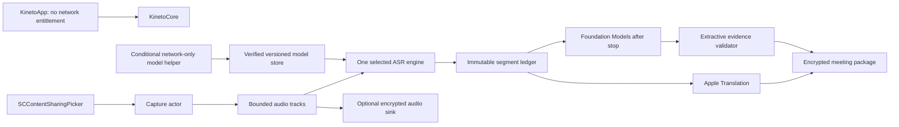

# Kineto local bilingual meeting slice

## Objective

Ship one native Apple Silicon macOS vertical slice: manual selected-app/display plus optional-microphone capture, volatile/finalized EN/VI transcript, finalized-segment EN↔VI translation, post-stop evidence-linked summary, encrypted local meeting package, and direct notarized distribution. No cloud, accounts, bots, diarization, auto-start, or autonomous actions.

## Implementation entry gate

Full Xcode 26.6 must be installed and selected. The current Command Line Tools-only workstation cannot build the app, create the static XCFramework, run app/UI tests, archive, sign, or notarize. Use Swift 6 mode and deploy to macOS 26.1; do not build against Xcode 27 beta.

## Architecture

## Non-negotiable invariants

- Source segment IDs and finalized text are immutable; translations/summaries only reference them.
- Microphone and selected-source audio remain separate timestamped tracks labeled `You` and `Selected Source`; use `Meeting` only after isolation is proven.
- Bounded queues apply explicit gap semantics; capture and finalized ASR outrank translation and summary.
- Raw audio off creates no audio artifact; optional retention streams directly into encrypted chunks.
- Every factual summary field must resolve to valid source IDs and extractive support; unknown owner/date/amount remains unknown.
- The capture app has no network-client entitlement and emits no transcript/audio/prompt/path/source-name content to logs.

## Phases

| Phase | Name | Status | Gate |
|---|---|---|---|
| 1 | [Toolchain and Scaffold](./phase-01-toolchain-and-scaffold.md) | Pending | App and Core build under pinned Xcode |
| 2 | [Domain and Secure Storage](./phase-02-domain-and-secure-storage.md) | Pending | Mutation/crash/deletion contracts pass |
| 3 | [Model Delivery and ASR](./phase-03-model-delivery-and-asr.md) | Pending | One ASR/checkpoint selected after EN/VI and 8 GB gate |
| 4 | [Capture and Live Transcript](./phase-04-capture-and-live-transcript.md) | Pending | Real Zoom/Meet/Teams capture and scope disclosure |
| 5 | [Translation and Summary](./phase-05-translation-and-summary.md) | Pending | Bidirectional translation and extractive evidence validation |
| 6 | [Native App Experience](./phase-06-native-app-experience.md) | Pending | Approved Dark Broadcast workflow works end to end |
| 7 | [Verification and Release](./phase-07-verification-and-release.md) | Pending | Hardware, privacy, consent, DMG, signing, notarization gates pass |

## Validation evidence

- Product contract: `docs/research-summary.md`
- Technology stack: `docs/technology-stack.md`
- Approved interface: `docs/design-guidelines.md`
- Interactive wireframe: `plans/design/kineto-wireframes.html`

## Open questions

- Developer ID team, certificate, and notarization profile must be supplied before Phase 7.
- The minimum supported Apple Silicon generation and 8 GB feature policy are set by measured Phase 3/5 gates.

## Red Team Review

### Session — 2026-07-18

**Findings:** 15 (15 accepted, 0 rejected)

| # | Accepted correction | Severity | Applied To |
|---|---|---|---|
| 1 | Isolate model networking from meeting data | High | Phases 1, 3, 7 |
| 2 | Independently reproduce native binaries and version model lifecycle | High | Phases 3, 7 |
| 3 | Define durable manifest, nonce, and locked-key contracts | High | Phase 2 |
| 4 | Make deletion terminal across every producer and stale generation | High | Phases 2, 4 |
| 5 | Reconcile all SwiftPM source/test paths | High | Phases 2–5 |
| 6 | Select ASR/checkpoint and prove 8 GB viability before downstream integration | High | Phases 3, 7 |
| 7 | Add the missing encrypted retained-audio consumer | High | Phases 2, 4 |
| 8 | Flush recognizer tail before sealing source evidence | High | Phase 4 |
| 9 | Persist capture gaps and prevent ASR across missing audio | High | Phase 4 |
| 10 | Make relaunch, derived stages, and export interruption-safe | High | Phases 2, 4–6 |
| 11 | Disclose and preserve the actual browser/application capture boundary | High | Phases 4, 6 |
| 12 | Validate extractive factual support, not citation existence | High | Phases 5, 6 |
| 13 | Test the worst supported SoC in each memory tier | High | Phases 3, 7 |
| 14 | Define and verify the exact signed/notarized DMG artifact | High | Phase 7 |
| 15 | Make consent/legal and sensitive-log checks executable release blockers | High | Phases 6, 7 |

### Whole-Plan Consistency Sweep

- Files reread: `plan.md` and all seven phase files.
- Decision deltas checked: 7 (network boundary, conditional ASR assets, hardware gates, secure lifecycle, capture truth, extractive evidence, release gates).
- Reconciled stale references: 13 across plan, research, stack, design guidelines, and wireframe.
- Unresolved contradictions: 0.
