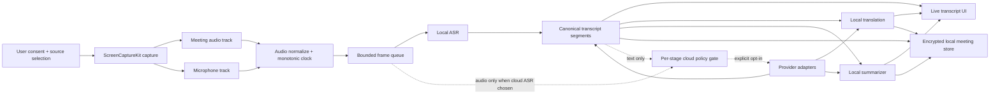

# Native macOS Live Meeting Intelligence

**Research date:** 2026-07-18  
**Scope:** Greenfield native macOS desktop app. Live transcription, Vietnamese/English/Mandarin translation, and meeting summaries for Zoom, Google Meet, and Microsoft Teams. Local processing by default; cloud providers optional.  
**Evidence state:** Repository was empty when assessed; no existing product architecture or roadmap constrained this recommendation.  
**Legal note:** Not legal advice. Recording, employment, privacy, and cross-border-data rules require launch-market counsel.

## Contents

1. [Executive verdict](#executive-verdict)
2. [Scope decisions](#scope-decisions)
3. [Target architecture](#target-architecture)
4. [Technology guidance](#technology-guidance)
5. [Apple Intelligence and macOS 27](#apple-intelligence-and-macos-27)
6. [Cloud provider strategy](#cloud-provider-strategy)
7. [Privacy, consent, and storage](#privacy-consent-and-storage)
8. [Platform integration strategy](#platform-integration-strategy)
9. [Risks and rejected shortcuts](#risks-and-rejected-shortcuts)
10. [Phased strategy](#phased-strategy)
11. [Validation experiments](#validation-experiments)
12. [Next actions](#next-actions)
13. [Sources](#sources)

## Executive verdict

**Feasible, with a narrow v1.** The correct product is a **native, local-first macOS capture pipeline**, not a bot for three meeting platforms and not a new AI model.

Recommended decisions:

- **Native Swift/SwiftUI, Apple Silicon only, deployment target macOS 26.1+.** This gives access to ScreenCaptureKit microphone capture, SpeechAnalyzer, Translation, Foundation Models, and the current Vietnamese/Chinese Apple Intelligence language rollout. Validate macOS 27, but do not make beta-only Core AI APIs a release dependency.
- **One common capture path:** ScreenCaptureKit captures selected application/system audio plus a separate microphone track. This covers Zoom, Meet, and Teams without three product integrations.
- **Keep five jobs separate:** capture, ASR, translation, diarization, and summarization have different inputs, latency, revisions, failure modes, models, and privacy consequences.
- **Local-only is the default and a hard mode.** It must not send audio, transcript, translation, summary, prompts, outputs, or telemetry to a model provider.
- **One cloud provider at most in v1.** OpenAI is the provisional first adapter because current official APIs cover realtime transcription, live speech translation, diarized batch transcription, and text generation. It still requires a paid-tier/privacy qualification and target-language benchmark.
- **No named remote speakers in v1.** The microphone track can be labelled “You.” The meeting/system mix can use anonymous, provisional Speaker A/B labels only after a diarization benchmark. Never present diarization as identity.
- **No raw-audio retention by default.** Preserve source transcript segments; derive translations and summary claims from those immutable finalized segments.
- **Consent is a release blocker.** External ScreenCaptureKit capture does not trigger Zoom/Meet/Teams’ native recording indicators. A clear external-capture disclosure, participant notice workflow, persistent recording indicator, and stop/delete controls are mandatory.

The credible wedge is **private, offline, reliable Vietnamese/English/Mandarin meeting intelligence with evidence-linked outputs**. “Works with Zoom, Meet, and Teams” is a compatibility statement, not differentiation.

## Scope decisions

### v1 product promise

- Manual, user-initiated capture of one meeting at a time.
- Selected Zoom/Teams application or supported browser application, plus optional microphone.
- Live source transcript with volatile and finalized states.
- Translation of finalized clauses between:
  - Vietnamese: `vi-VN`;
  - English: initial reference locale `en-US`, with accented-English test coverage;
  - Mandarin Chinese with Simplified output: `zh-CN` / `zh-Hans`.
- Rolling and final meeting summaries with transcript citations:
  - overview;
  - decisions;
  - action items only when owner/deadline are explicit;
  - open questions;
  - risks/blockers.
- Local persistence and explicit export.
- Optional per-session cloud processing, disabled by default.

### Explicitly deferred

- Cantonese, Traditional Chinese output, and unsupported Chinese varieties.
- Auto-start, calendar-triggered recording, hidden/background capture, and unattended capture.
- Zoom/Meet/Teams bots, roster identity, chat ingestion, platform recording controls, and official partnership claims.
- Voiceprints, cross-meeting speaker recognition, emotion/gender/accent inference.
- Automatic emails, task creation, calendar changes, or any tool execution from transcript content.
- Five cloud-provider parity, cloud sync, team workspaces, and shared billing.
- Building or training a proprietary foundation model.

## Target architecture

### System boundary

Start as one sandbox-compatible native application with logical modules. Do not introduce XPC helpers, a backend, plugins, or microservices until a measured fault-isolation or managed-cloud requirement exists.

### Capture pipeline

1. User selects an exact source and microphone state.
2. Preflight explains that capture is external to Zoom/Meet/Teams and requires participant notice/authority.
3. ScreenCaptureKit creates a stream filtered to the selected source.
4. System/application audio and microphone remain separate tracks.
5. Convert to a model-supported PCM format once; retain monotonic timestamps.
6. Feed bounded queues. Never let translation, summary, disk, or network backpressure block capture.
7. On stop, drain ASR finalization, then finalize translation and summary.
8. On crash, sleep, wake, source loss, or permission revocation: stop. Never auto-resume.

Browser isolation is an unresolved product constraint. A selected browser window may not imply isolated per-tab audio. The capture matrix must establish and disclose the actual boundary for each supported browser.

### Canonical records

Keep the source transcript authoritative. Derived output never overwrites it.

- **Transcript segment:** stable ID, start/end monotonic time, source track, source language, text revision, volatile/final state, confidence when available, anonymous speaker reference, model/version provenance.
- **Translation segment:** source segment ID, source/target locale, translated text, engine/version, final state.
- **Summary claim:** type, text, supporting source segment IDs, confidence/uncertain state, engine/version, user-edited state.
- **Meeting policy:** selected source, local/cloud mode, provider received data, consent confirmation, retention choice, creation/end times.

Provider-specific events terminate at adapters. The rest of the app consumes these stable stage records rather than provider JSON.

### Runtime priorities and failure behavior

Priority order:

1. capture continuity;
2. finalized transcription;
3. live transcription revisions;
4. translation;
5. summarization and indexing.

Use bounded queues and cancellation. Under memory pressure or thermal throttling, pause summary first, then translation; keep capture and ASR alive. If the selected local engine cannot sustain realtime processing, show degradation and narrow supported device/configuration tiers. **Never silently switch to cloud.**

## Technology guidance

### macOS application stack

| Area | Recommendation | Why | Main limitation |
|---|---|---|---|
| UI/app | Swift + SwiftUI; AppKit only where macOS behavior requires it | Native permissions, accessibility, energy behavior, App Store alignment | Requires macOS-specific engineering |
| Capture | ScreenCaptureKit | Public API; selected display/app/window audio; separate microphone capture on macOS 15+ | Permission friction; browser source isolation must be measured |
| Audio processing | AVFoundation/Core Audio buffers and monotonic timestamps | Native formats and low-copy processing | Format negotiation and drift need soak tests |
| ASR default | SpeechAnalyzer/SpeechTranscriber when runtime locale and benchmark pass | On-device; volatile/final results; designed for long-form and meetings | macOS 26+; downloadable assets; runtime language availability; quality unknown until corpus test |
| ASR fallback candidate | Benchmark WhisperKit and whisper.cpp with Whisper large-v3-turbo; ship one | MIT implementations/weights; target languages documented by Whisper | Model memory/thermal cost; Whisper translation is only to English; open-source diarization is separate |
| Translation default | Apple Translation framework on finalized clauses | On-device, dedicated translation models, runtime language-pair availability | Requires model download and supported pair; not a streaming-token API |
| Summarization default | Foundation Models adapter, runtime-gated; chunk finalized transcript | On-device, structured generation; no bundled LLM weight | macOS 26+, Apple Intelligence eligibility/settings/language/context limits |
| Local summary fallback | No summary, or later one separately benchmarked commercially redistributable local model | Honest degradation is better than a hidden cloud call | Bundled LLM can exceed memory budget when ASR is active |
| Diarization | Track separation first; anonymous diarization only after benchmark | “You” versus “Meeting” is reliable and cheap | Remote participant identity is unavailable from mixed local audio |
| Persistence | SQLite metadata + CryptoKit-encrypted sensitive payloads; key in Keychain | Simple local source of truth and explicit encryption boundary | Search/indexing over encrypted text requires deliberate design |
| Credentials | Keychain only | Correct macOS secret store | Must still provide revoke/delete and redact diagnostics |

### Local model conclusions

- **Do not build a model.** Integrate and benchmark existing engines.
- **Apple SpeechAnalyzer is the preferred default**, contingent on runtime locale support and measured Vietnamese/Mandarin/code-switching quality.
- **Whisper is a strong fallback candidate for ASR**, not a complete translation layer. Official Whisper language support includes Chinese, English, and Vietnamese, but audio translation output is English only.
- **Use dedicated MT for all six translation directions.** Apple Translation is the KISS path. OPUS-MT/Marian pair models are commercially permissive candidates but multiply artifacts and require quality validation. Do not ship Meta NLLB-200 distilled or SeamlessM4T under their published non-commercial licenses in a paid product without a separate grant.
- **Do not promise simultaneous large ASR + local MT + local LLM + live diarization on every Apple Silicon Mac.** Benchmark memory, realtime factor, thermal state, and battery. 8 GB support is not credible until proven.

### Translation behavior

- Show volatile source captions if useful.
- Translate only endpointed/finalized clauses to avoid flicker and semantic reversal.
- Keep source and translation side by side.
- Preserve names, numbers, dates, currency, negation, and glossary terms as explicit error classes.
- Label machine translation and supported language variety/script.
- No certified/legal/medical translation claim.

### Summarization behavior

- Summarize finalized transcript text, never raw volatile tokens.
- Chunk by turn/topic using the runtime-reported context size; merge structured partial summaries.
- Treat transcript text as untrusted data, not model instructions.
- Give the summarizer no tools and no autonomous side effects.
- Every decision/action item links to source timestamps and original-language text.
- If evidence is missing or contradictory, mark uncertainty or omit the claim.

## Apple Intelligence and macOS 27

### What exists now

- **Foundation Models, macOS 26+:** public Swift access to Apple’s on-device text model for generation/understanding. Runtime availability can fail when Apple Intelligence is disabled, the device is ineligible, or model assets are not ready. Query supported locale and context size at runtime.
- **SpeechAnalyzer/SpeechTranscriber, macOS 26+:** on-device speech-to-text APIs with volatile/final results and downloadable assets. Query supported locales at runtime.
- **Translation, macOS 15+:** on-device language-pair translation with downloadable models.
- **App Intents:** expose safe app actions to Siri/Shortcuts. For consent, an intent may open the capture preflight; it should not silently start recording.

### What macOS 27 changes

- **Core AI, macOS 27:** public Swift framework for deploying/running custom AI model assets on CPU, GPU, and Neural Engine, with specialization, caching, encryption, and profiling. This could eventually replace a third-party custom-model runtime.
- Core AI is current beta-era platform technology as of this research date. Xcode 27 beta distribution has release constraints. Treat it as a post-v1 adapter until the OS/SDK reaches general availability and the exact ASR/MT model path is benchmarked.

### Siri misconception

“Siri’s local AI” is not a general third-party inference endpoint. Use:

- **Foundation Models** for Apple’s on-device text model;
- **SpeechAnalyzer** for ASR;
- **Translation** for MT;
- **App Intents** for Siri/Shortcuts actions;
- **Core AI** later for custom model assets.

Do not market a future Siri capability or make macOS 27 beta a dependency.

## Cloud provider strategy

### Provider comparison

| Provider | Realtime ASR | Translation role | Summary role | Authentication reality | Recommendation |
|---|---|---|---|---|---|
| OpenAI | Yes; realtime transcript deltas. Diarized transcription is currently non-Realtime | Dedicated live speech translation exists; legacy audio translation is English-only | Yes | API key; server-minted ephemeral client secret for managed realtime clients | **Provisional first cloud adapter**, after paid-tier/privacy and language benchmark |
| Anthropic Claude | No documented live-audio input on current model overview | Text translation via LLM only | Strong transcript summarizer candidate | API key or workload identity for managed enterprise access; not consumer “Sign in with Claude” | Add only for measured summary demand |
| Google Gemini | Live audio/input transcription exists; Google recommends Cloud Speech-to-Text for dedicated realtime STT | Live/LLM translation exists | Yes | API key; Live API ephemeral tokens should be server-minted. Free/unpaid Gemini terms are unsuitable for confidential meeting data | Paid-only alternative; not v1 parity target |
| Groq | Official speech endpoints are file/bounded audio; near-live requires chunking | Whisper endpoint translates into English only | Text models available | API key | Fast batch/finalization option, not primary realtime abstraction |
| xAI Grok | WebSocket STT with timestamps, multichannel, and diarization | No dedicated all-direction MT established in reviewed docs | Text models available | API key; official docs advise proxying WebSocket connections | Experimental; documented language list did not establish Chinese support |

### Authentication decision

The phrase “OAuth or API key” hides three distinct products:

1. **BYOK:** User pastes a provider API key. Store only in Keychain. Direct provider use is advanced mode, subject to provider terms. Show provider/account, test, replace, and delete/revoke controls.
2. **Managed cloud:** User signs into this product; company-owned provider secrets stay server-side. A minimal token broker issues provider ephemeral credentials where supported and enforces quotas/abuse controls. This makes the company a data processor and adds backend/compliance obligations.
3. **Meeting-platform OAuth:** Needed only when future roster/chat/calendar/platform media APIs add essential value. Use external browser + authorization-code PKCE, least scopes, and Keychain refresh-token storage. Native apps cannot safely keep a shared OAuth client secret.

Do not build a universal “AI provider” interface. Define stage contracts, then small provider-specific adapters. Authentication, session events, diarization, timestamps, retention, and failure semantics are not interchangeable.

### Cloud egress policy

Cloud selection is per session and per stage:

- cloud ASR sends audio;
- cloud translation sends finalized source text;
- cloud summary sends finalized transcript text;
- local-only sends neither.

Before sending, show provider, data type, purpose, region/retention/training statement, and privacy link. Record which provider received which stage. No silent fallback between local/cloud or providers.

## Privacy, consent, and storage

### Non-negotiable controls

Before capture:

- exact selected app/window/display and microphone state;
- external-capture disclosure: Zoom/Meet/Teams may show no recording indicator;
- local/cloud badge and stage-level data disclosure;
- retention choice for audio, transcript, translation, summary, and speaker labels;
- affirmative operator confirmation that participants were notified and capture is authorized;
- localized notice text to read aloud or paste into chat.

During capture:

- persistent, unmistakable visual indicator with source, mode, and elapsed time;
- pause, stop, and “stop + delete session”;
- visible warning on source/provider/microphone change;
- no auto-resume.

After capture:

- source transcript and translation side by side;
- summary evidence links;
- editable provisional speaker labels;
- explicit machine-generated disclosure;
- retention/delete controls and provider-receipt log.

Apple App Review Guideline 2.5.14 requires explicit user consent and a clear visual and/or audible recording indication. Platform-native indicators do not cover this external capture. Launch-market counsel must approve consent, employment, privacy, retention, and cross-border handling.

### Storage posture

- Raw audio: bounded memory only by default; optional retention requires a distinct user choice.
- Transcript payloads and derived outputs: encrypt per meeting with CryptoKit; store key material in Keychain; metadata minimization.
- No transcript/prompt/output/credential in application logs, analytics, crash reports, clipboard history, Spotlight, or cloud backups by default.
- Atomic meeting deletion removes app-controlled transcript, translation, summary, speaker metadata, caches, temporary audio, and encryption keys.
- Exports are explicit and outside the app’s deletion guarantee; warn the user.

## Platform integration strategy

### v1: device-local capture

This is the only coherent common denominator across Zoom, Google Meet, and Teams. It has one native product, one permission model, and one local processing pipeline.

### Later enterprise adapters

- **Zoom RTMS:** official paid live media/transcript path; useful for separated participant tracks and cloud-scale workflows. Separate product/deployment/auth/billing model.
- **Google Meet Media API:** current docs describe developer-preview access and participant enrollment/consent constraints. Not a dependable v1 foundation.
- **Teams application-hosted media bots:** current requirements are developer-preview, C#/.NET, Azure-hosted, public-reachable, Windows Server infrastructure. It is not an adapter inside a native Mac app.

These platform paths may improve identity and source separation, but they create three deployment products. Add one only when a paying segment needs it.

## Risks and rejected shortcuts

### Highest risks

| Risk | Why it matters | Release gate |
|---|---|---|
| Invisible external capture / invalid consent | Potential unlawful capture and platform-policy conflict | Counsel-approved flow; persistent indicator; participant notice; objection/stop/delete behavior |
| Wrong source captured | Browser tabs, notifications, or another meeting may leak | Capture boundary matrix; narrow source selection; stop on source change |
| Tri-language semantic errors | Negation, names, owners, dates, and amounts can reverse decisions | Rights-cleared corpus; stage-specific ASR/MT/summary metrics; evidence links; human confirmation |
| Cloud disclosure | Audio/text may enter provider retention, training, human-review, or foreign processing regimes | Paid qualified endpoint; explicit per-stage opt-in; DPA/retention/residency record; kill switch |
| Thermal/memory failure | Concurrent ASR/MT/LLM/diarization can miss audio | Endurance tests by device capability; bounded queues; degrade summary/translation first |
| Model licensing/supply chain | Code license does not automatically cover weights/tokenizers; non-commercial models can block a paid release | Exact artifact BOM, checksums, pinned licenses, no arbitrary model URLs or remote code |
| Summary hallucination/prompt injection | Spoken instructions can manipulate generated output | Transcript treated as data; no tools; citation requirement; no automatic actions |
| Commodity product | Native meeting recap and independent assistants already exist | Paid pilot proving a narrow privacy/language wedge before broad integrations |

### Rejected shortcuts

- Capturing all system audio because source filtering is difficult.
- Accessibility permission, UI scraping, process injection, private APIs, or a virtual audio driver for v1.
- Auto-start based on calendar, microphone, process, or browser-tab detection.
- Assuming “no saved audio” removes recording/consent obligations.
- Calling anonymous diarization speaker identity.
- Using Whisper as arbitrary Vietnamese↔English↔Chinese translation.
- Shipping NLLB/SeamlessM4T non-commercial artifacts in a paid app without a separate license.
- Embedding shared provider secrets or OAuth client secrets in the app.
- Sending meeting content to free/unpaid Gemini.
- Promising five interchangeable cloud providers.
- Depending on Apple Intelligence availability or macOS 27 beta APIs.
- Silent cloud/provider fallback.

## Phased strategy

### Gate 0 — Prove the product boundary

- Run capture/permission matrix across Zoom native, Teams native, Meet in supported browsers, audio devices, permission denial/revocation, source changes, sleep/wake, and crash/relaunch.
- Resolve browser tab-versus-app capture semantics.
- Conduct consent/platform-terms/legal review.
- Run a paid-demand pilot for the privacy-first tri-language wedge.

**Exit:** Exact supported configurations, lawful bounded launch, and evidence of repeat demand.

### Phase 1 — Local transcription product

- Native source picker and consent preflight.
- Separate system/microphone capture.
- SpeechAnalyzer versus one Whisper runtime bakeoff.
- Volatile/final transcript lifecycle.
- Encrypted local meeting storage, retention, delete, and export.
- Vietnamese, English, and defined Mandarin/Simplified quality gates.

**Exit:** Continuous two-hour capture/ASR on every advertised device tier without lost audio; target-language corpus passes pre-registered quality criteria.

### Phase 2 — Translation

- Apple Translation runtime availability and model-download UX.
- Finalized-clause translation for all six directions.
- Source/translation side-by-side, glossary, uncertainty and correction.

**Exit:** Human review passes names/numbers/negation/domain terminology; unsupported pairs degrade honestly.

### Phase 3 — Evidence-linked summaries

- Runtime-gated Foundation Models adapter.
- Structured rolling/final summaries from finalized segments.
- Segment citations, explicit uncertainty, user edits, no tools.

**Exit:** No unsupported decision/action item in the adversarial evaluation; unavailable Apple Intelligence produces a supported non-cloud state.

### Phase 4 — One optional cloud provider

- Qualify one paid provider/tier contractually and technically.
- BYOK Keychain flow first; managed token broker only if business model requires it.
- Per-stage egress controls, provider receipts, rate/billing/error behavior, local fallback.

**Exit:** No silent egress; revocation and provider outage tests pass; cloud path beats local on a measured user need.

### Phase 5 — Selective expansion

Only against demand: Claude/Gemini/Groq/xAI stage adapters, anonymous diarization, one platform enterprise media API, macOS 27 Core AI custom runtime, App Intents, managed accounts/sync.

## Validation experiments

### 1. Capture and permission boundary matrix

Run scripted, consented meetings across supported macOS versions, Zoom/Teams native apps, Meet browsers, built-in/Bluetooth/USB devices, headphones, simultaneous media, notifications, source switching, sleep/wake, crashes, and permission denial/revocation.

Hard gates:

- zero capture before consent/preflight;
- zero audio from an unselected source in supported configurations;
- stop/delete terminates and removes buffers;
- no auto-resume;
- accurate visible source/mode;
- recoverable permission denial and revocation.

Failure narrows advertised support; it does not justify broader capture permission.

### 2. Multilingual truthfulness and endurance benchmark

Build a consented, rights-cleared corpus with Vietnamese regional accents, accented English, Mandarin, rapid code-switching, names, dates, currency, domain vocabulary, overlap, noise, packet loss, and low-quality microphones. Human annotators create source transcript, translations, speaker turns, decisions, and actions.

Measure separately:

- ASR WER/CER and severe semantic errors;
- finalized-caption latency and revision stability;
- human translation error categories, especially inversion/negation/numbers;
- diarization error if enabled;
- summary factuality, coverage, citation correctness, and prompt-injection resistance;
- realtime factor, memory, thermal state, energy use, and clock drift over long meetings.

Pre-register pass/fail thresholds before choosing engines. Any fabricated decision, inverted amount/date/negation, or confident wrong owner is a severe error regardless of aggregate score.

### 3. Consent/compliance and paid-demand pilot

Use the real preflight disclosure, notice template, objection/stop/delete flow, retention choices, local/cloud controls, and a priced offer with the intended user segment plus organizers/participants and privacy/IT reviewers.

Measure participant comprehension, permission drop-off, objections, local-versus-cloud choice, repeat use, willingness to pay, and procurement blockers. Pass only if counsel approves a bounded launch, users understand the missing platform-native indicator, and a target segment repeatedly chooses the privacy/language workflow.

## Next actions

1. Freeze v1 language semantics: Vietnamese, English reference locale, Mandarin versus Cantonese, Simplified versus Traditional output, and code-switching claims.
2. Write the capture/permission test matrix before product UI work.
3. Acquire a rights-cleared tri-language evaluation corpus and human reviewers.
4. Benchmark SpeechAnalyzer against WhisperKit and whisper.cpp; choose one fallback, not two.
5. Verify Apple Translation and Foundation Models runtime availability for every promised locale/device state.
6. Obtain counsel review for consent, launch jurisdictions, employment use, platform terms, privacy policy, and cloud transfers.
7. Run the paid-demand pilot before building provider parity or platform bots.
8. If gates pass, create architectural decision records for OS baseline, ASR engine, translation engine, distribution channel, storage encryption, and first cloud provider.

## Sources

### Apple platform

- [ScreenCaptureKit — Capturing screen content in macOS](https://developer.apple.com/documentation/screencapturekit/capturing-screen-content-in-macos)
- [ScreenCaptureKit — `captureMicrophone`](https://developer.apple.com/documentation/screencapturekit/scstreamconfiguration/capturemicrophone)
- [WWDC25 — Bring advanced speech-to-text to your app with SpeechAnalyzer](https://developer.apple.com/videos/play/wwdc2025/277/)
- [SpeechTranscriber supported locales](https://developer.apple.com/documentation/speech/speechtranscriber/supportedlocales)
- [Translation framework](https://developer.apple.com/documentation/translation)
- [Foundation Models — SystemLanguageModel](https://developer.apple.com/documentation/foundationmodels/systemlanguagemodel)
- [Foundation Models — context size](https://developer.apple.com/documentation/foundationmodels/systemlanguagemodel/contextsize)
- [Core AI, macOS 27+](https://developer.apple.com/documentation/coreai)
- [App Intents](https://developer.apple.com/documentation/appintents)
- [App Review Guidelines](https://developer.apple.com/app-store/review/guidelines/)
- [Keychain Services](https://developer.apple.com/documentation/security/keychain-services)
- [Apple Intelligence availability](https://support.apple.com/en-us/121115)
- [macOS 27 release notes](https://developer.apple.com/documentation/macos-release-notes/macos-27-release-notes)

### Meeting platforms

- [Zoom Realtime Media Streams](https://developers.zoom.us/docs/rtms/)
- [Google Meet Media API overview](https://developers.google.com/workspace/meet/media-api/guides/overview)
- [Microsoft Teams application-hosted media bot requirements](https://learn.microsoft.com/en-us/microsoftteams/platform/bots/calls-and-meetings/requirements-considerations-application-hosted-media-bots)

### Cloud providers

- [OpenAI realtime transcription](https://developers.openai.com/api/docs/guides/realtime-transcription)
- [OpenAI realtime translation](https://developers.openai.com/api/docs/guides/realtime-translation)
- [OpenAI speech-to-text and supported languages](https://developers.openai.com/api/docs/guides/speech-to-text)
- [OpenAI API data controls](https://developers.openai.com/api/docs/guides/your-data)
- [Anthropic model modalities](https://platform.claude.com/docs/en/about-claude/models/overview)
- [Anthropic API authentication](https://platform.claude.com/docs/en/api/overview)
- [Gemini audio guidance](https://ai.google.dev/gemini-api/docs/audio)
- [Gemini Live API ephemeral tokens](https://ai.google.dev/gemini-api/docs/live-api/ephemeral-tokens)
- [Gemini API terms](https://ai.google.dev/gemini-api/terms)
- [Groq speech-to-text](https://console.groq.com/docs/speech-to-text)
- [xAI speech-to-text](https://docs.x.ai/developers/model-capabilities/audio/speech-to-text)

### Open-source models and native-app auth

- [WhisperKit](https://github.com/argmaxinc/WhisperKit)
- [whisper.cpp](https://github.com/ggml-org/whisper.cpp)
- [OpenAI Whisper language/model scope](https://github.com/openai/whisper#available-models-and-languages)
- [Meta NLLB-200 distilled 600M model card/license](https://huggingface.co/facebook/nllb-200-distilled-600M)
- [Meta SeamlessM4T v2 large model card/license](https://huggingface.co/facebook/seamless-m4t-v2-large)
- [OPUS-MT Vietnamese→English](https://huggingface.co/Helsinki-NLP/opus-mt-vi-en)
- [RFC 8252 — OAuth 2.0 for Native Apps](https://www.rfc-editor.org/rfc/rfc8252.html)
