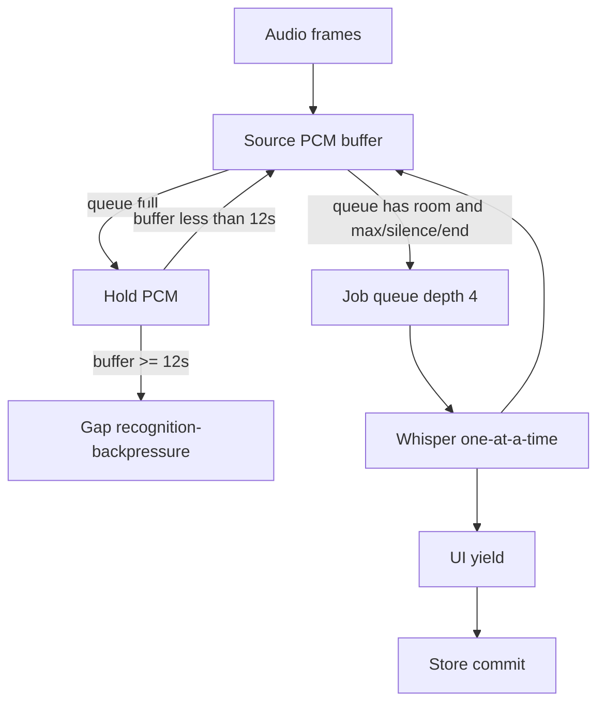

# Research Report: Transcript Gaps After Latency Tuning

- **Date:** 2026-07-18
- **Scope:** Why Kineto showed many transcript gaps after latency knobs; how to improve without dropping speech
- **Status:** Root cause identified; hold-buffer fix implemented in `TranscriptCoordinator`

## Executive Summary

Gaps got worse because latency tuning **over-produced short recognition jobs** while the queue still **dropped audio** when full (`maximumQueuedJobsPerSource` was 2, drop → `recognition-backpressure`).

That is the wrong backpressure policy for live meetings. Industry practice: **hold/bound buffer when ASR is busy; do not drop frames** except at a hard memory ceiling. Over-aggressive VAD/silence cuts cause over-segmentation and backlog.

**Fix direction (done in code):**  
1. Hold PCM when queue full (no drop)  
2. Safer silence defaults (less aggressive)  
3. Deeper queue (4) + 12s hard buffer before any drop  
4. Keep publish-before-store for snappy UI  

Expect: **far fewer gaps**, slightly more lag under load (honest tradeoff).

## Research Methodology

- Sources consulted: 3 web research passes + Kineto coordinator/capture code
- Date range: 2024–2026 streaming ASR practice
- Key terms: backpressure, hold buffer, VAD over-segmentation, whisper streaming queue, real-time STT latency

## Key Findings

### 1. What the gaps actually were

| Reason | Meaning |
|---|---|
| `recognition-backpressure` | Job queue full → **audio discarded** (old path) |
| `capture-ingress-backpressure` / `capture-backpressure` | Capture admission/output buffer full |
| `capture-discontinuity` | Timestamp hole in stream |
| `recognition-failed` | Whisper/store error for interval |
| `source-lost` | Selected source ended |

User “many gaps” after latency work strongly matches **`recognition-backpressure`**: silence flush + shorter max chunk → more jobs/sec → queue of 2 overflows → drop speech → gap rows.

### 2. Why latency knobs backfired

Previous aggressive settings:

```text
max chunk 1.2s
min silence cut 0.5s
silence hold 0.25s
relative pause 22%
queue depth 2
drop when full
```

Effects:

1. **More cuts** → more Whisper invocations  
2. Single Whisper actor still **serial**  
3. Queue fills while ASR runs  
4. Old `cutJob` **dropped** the new job as a gap  
5. UI looks broken: holes everywhere, “worse than before”

Classic latency vs continuity failure mode.

### 3. External consensus

- Streaming STT must handle backpressure with **throttle/buffer**, not silent drop ([realtime STT best practices](https://docs.smallest.ai/waves/documentation/speech-to-text-pulse/realtime-web-socket/best-practices), [latency guides](https://picovoice.ai/blog/speech-to-text-latency/)).
- Aggressive VAD/short chunks cause **over-segmentation**, backlog, missed phrases ([faster-whisper VAD/batch issues](https://github.com/SYSTRAN/faster-whisper/issues/1270)).
- Adaptive buffering: capture never blocks; ASR consumes when free; **cap memory**; avoid unbounded growth ([streaming ASR architecture notes](https://www.arunbaby.com/speech-tech/0001-streaming-asr/), WhisperPipe-style bounded streaming).

### 4. Security / privacy

No new network surface. Holding ≤12s PCM in RAM is still **no disk audio retention**. Aligns with audio-off product boundary.

### 5. Performance

| Policy | Latency | Continuity | Gaps |
|---|---|---|---|
| Drop on queue full | Looks “fast” until overload | Destroys speech | **Many** |
| Hold buffer | Grows under load | Keeps speech | **Few** |
| Volatile partials | Best perceived | Complex | N/A |

Hold buffer is correct default for meetings.

## Comparative Analysis

| Approach | Pros | Cons | Kineto fit |
|---|---|---|---|
| Drop jobs (old) | Bounded queue simple | Holes, user rage | **Reject** |
| Hold PCM (new) | Continuity | RAM up to hard cap; lag under load | **Ship** |
| Dual Whisper contexts | Parallel You/Source | ~2× memory/thermal | Later if dual-track lag |
| Volatile partials | Caption feel | New UI contract | Separate plan |
| Smaller model | Faster RTF | Quality | Only if RTF proven bad |

## Implementation Recommendations

### Done in this pass

```text
TranscriptCoordinator:
  - cut jobs only if queue has capacity
  - else hold samples in source buffer
  - drop only if buffer >= hardBufferDuration (12s)
  - defaults: max 2.0s, min 0.8s, silence 0.4s, relative 15%, queue 4
  - publish UI before store (kept)
  - test: slow recognizer + many frames → 0 backpressure gaps, all samples recognized
```

### Quick verification for you

1. Rebuild/relaunch app  
2. Run a live meeting 2–3 minutes  
3. Count gap rows / reasons  
4. Expect `recognition-backpressure` ≈ 0 unless machine is severely overloaded for >12s  

### Common pitfalls

- Chasing lower min chunk without hold-buffer → gap storm (we hit this)  
- Treating gaps as “UI noise” to hide → hides real loss  
- Unbounded hold → memory death; always keep hard ceiling  

## Architecture (after fix)



## Resources & References

- Kineto code: `Packages/KinetoCore/Sources/KinetoCore/ASR/TranscriptCoordinator.swift`
- Prior latency report: `plans/reports/260718-2348-live-transcript-latency.md`
- [Picovoice – STT latency](https://picovoice.ai/blog/speech-to-text-latency/)
- [Smallest AI realtime WS best practices](https://docs.smallest.ai/waves/documentation/speech-to-text-pulse/realtime-web-socket/best-practices)
- [faster-whisper VAD/batch fragmentation](https://github.com/SYSTRAN/faster-whisper/issues/1270)
- [Streaming ASR overview](https://www.arunbaby.com/speech-tech/0001-streaming-asr/)

## Next Actions

1. Run package tests + Debug build  
2. Live trial: confirm gap count collapse  
3. If still slow **without** gaps: instrument Whisper ms (real RTF)  
4. Only then consider dual context or volatiles  

## Unresolved Questions

1. Which gap `reason` strings dominated your session? (confirm backpressure vs capture)  
2. Mic+selectedSource both on? (serial Whisper contention)  
3. Acceptable max hold lag before showing a soft “catching up…” UI state?

## Appendix: Default knobs now

| Knob | Value |
|---|---|
| max chunk | 2.0s |
| min silence cut | 0.8s |
| silence hold | 0.4s |
| relative pause | 15% of speech RMS |
| queue depth | 4 |
| hard hold buffer | 12s |
| drop policy | only past hard buffer |
